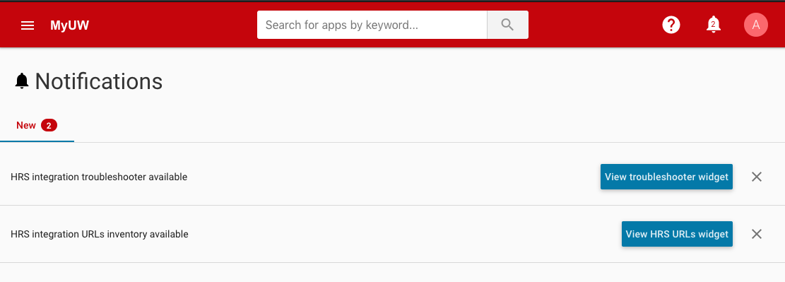

# Messaging

Messaging features in the app framework include

+ "Notifications" available in the notification bell in the top app bar,
+ "Banners" across the top of the page under the top app bar,
+ "Tablecloths" over top of individual widgets, and
+ "Maintenance messages" on disabled widgets

## Notifications

Notifications are messages about **you** (i.e. the user).

Preferably these are *actionable* and the user can resolve them and thereby
make them go away. They're conceptually a "to do list" of important stuff to
take action upon.

The idea is that a user might be accessing MyUW for purpose A,
notice a notification, thereby become aware of task B,
and click into the notification to take action to complete B.

cf.

+ [MyUW Notifications Overview][]
+ [MyUW Notifications Guidelines][]

### Notification bell

The top app bar shows a bell icon button at all screen widths.

If the user has unresolved notifications,
the bell displays the quantity of those unresolved notifications.
In the below example, the user has 2 unresolved notifications.

At sufficiently wide widths, clicking the notification button opens a drawer
detailing the notifications and offering a hyperlink to the notifications page.
(At too-narrow widths, clicking the button navigates directly to the notifications page.)

### Mobile menu link

In addition to the bell icon, the left hand hamburger menu includes a link to notifications.

### Priority notifications (DEPRECATED)

DEPRECATED.

Previously, priority notifications got emphatic UI treatment including
showing as a bar at the top of the page.

Currently, priority notifications show in the same places and ways
as non-priority notifications.
Priority notifications get a little extra emphasis where they appear.

This feature is deprecated. Consider using a banner message instead.

### Notifications page

On the notifications page, users can view, follow calls to action on, and
dismiss their notifications. They can also click the "Dismissed" tab to view
notifications they've previously dismissed. High priority notifications
(DEPRECATED) float to the top of the lists.

## Banner messages

Separately from the bell notifications, the framework supports banner messages.

Banner messages have message text, an optional icon, and an optional single
action button.

## Widget messaging

Widget messaging can interrupt a user's interaction with a widget. The user can
continue to use the widget after dismissing the dialog that appears
appears over the widget. Optionally a `Learn more` button can link to a learn
more page.

[MyUW Notifications Overview]: https://kb.wisc.edu/myuw/71187
[MyUW Notifications Guidelines]: https://docs.google.com/document/d/1xa3t5gibaSgYGtGBKeIt0EGMC9XSMaOwVlgJtMCZ-Vg/edit
