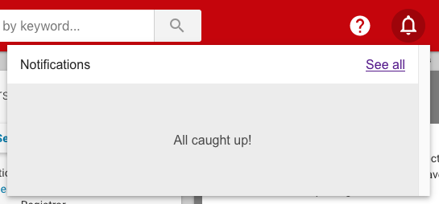
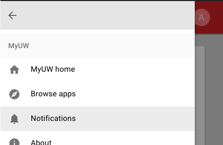
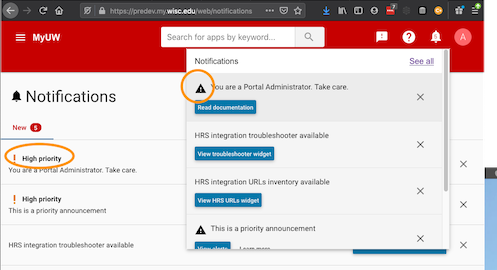

# Messaging

Messaging features in the app framework include

+ "Notifications" available in the notification bell in the top app bar,
+ "Banners" across the top of the page under the top app bar,
+ "Tablecloths" over top of individual widgets, and
+ "Maintenance messages" on disabled widgets

## Notifications

Notifications are messages about **you** (i.e. the user).

Preferably these are *actionable* and the user can resolve them and thereby
make them go away. They're conceptually a "to do list" of important stuff to
take action upon.

The idea is that a user might be accessing MyUW for purpose A,
notice a notification, thereby become aware of task B,
and click into the notification to take action to complete B.

cf.

+ [MyUW Notifications Overview][]
+ [MyUW Notifications Guidelines][]

### Notification bell

The top app bar shows a bell icon button at all screen widths.


If the user has unresolved notifications,
the bell displays the quantity of those unresolved notifications.
In the below example, the user has 2 unresolved notifications.


At sufficiently wide widths, clicking the notification button opens a drawer
detailing the notifications and offering a hyperlink to the notifications page.
(At too-narrow widths, clicking the button navigates directly to the notifications page.)




### Notifications in hamburger menu

In addition to the bell icon, the left hand hamburger menu includes a link to notifications.





### Priority notifications (DEPRECATED)

DEPRECATED.

Previously, priority notifications got emphatic UI treatment including
showing as a bar at the top of the page.

Currently, priority notifications show in the same places and ways
as non-priority notifications.
Priority notifications get a little extra emphasis where they appear.

This feature is deprecated. Consider using a banner message instead.

### Notifications page

On the notifications page, users can view, follow calls to action on, and
dismiss their notifications. They can also click the "Dismissed" tab to view
notifications they've previously dismissed. High priority notifications
(DEPRECATED) float to the top of the lists.


### Configuring notifications

Notifications reflect JSON data sourced from a URL. See the
[configuraton](configuration.md) doc for information about how to
point uportal-app-framework to a notifications feed.

### Example bell notification message

*Note: All messages must be contained within the "messages" array.*

```json
{
  "messages": [
    {
      "id": "sample-unactivated-services-notification",
      "title": "Activate essential UW services on your NetID account.",
      "goLiveDate": "2017-08-01T09:30",
      "expireDate": "2017-08-02",
      "priority": "high",
      "dismissible": false,
      "audienceFilter": {
        "groups": ["Users - Service Activation Required"],
      },
      "data": {
        "dataUrl": "/restProxyURL/unactivatedServices",
        "dataObject": "services",
        "dataArrayFilter": {"priority":"essential", "type":"netid"},
        "dataMessageTitle": ["result", "title"],
        "dataMessageMoreInfoUrl": ["result", "url"],
      },
      "actionButton": {
        "label": "Activate services",
        "url": "https://services.wisc.edu/go/example/path"
      },
      "moreInfoButton": {
        "label": "Learn more",
        "url": "/learnMore"
      }
    }
  ]
}
```

#### Notification message JSON elements explained

+ **id**: A unique string to identify the message. This is used for tracking
  seen/unseen messages, dimissed notifications, and the sort order on the
  notifications page.
+ **title**: The text to be displayed as the message's main content.
  **Best practices:**
  + Be concise! Limit the title to 140 characters. Shorter titles improve
    click-through and are more likely to display correctly on smaller screens.
    *Titles longer than 140 characters will be truncated (with ellipsis)* for
    consistent appearance.
  + Use general language and avoid pronouns for broadly visible messages that
    may not be relevant to the viewing user (example:
    "City of Madison - Declared Snow Emergency").
  + Use the word "You" for well-targeted messages known to be relevant to the
    viewing user. ("You have an unpaid parking ticket.")
+ **goLiveDate**: *(optional)* ISO date, including time. The
  message will display only after this moment.
  These dates are currently evaluated client-side.
+ **expireDate**: *(optional)* ISO date, including time. The
  message will display only before this moment.
  These dates are currently evaluated client-side.
+ **priority**: DEPRECATED "high" triggers slight emphasis in display
 **dismissible**: *(experimental, optional)* `false` prevents dismissing the
  notification. If `true` or not set at all, the notification will be
  dismissible.
+ **audienceFilter**: Configures filtering messages to
  their intended audiences.
  + **groups**: *(optional)* Optionally show messages only to specific groups
    (i.e. uPortal groups) named in this array. If omitted, null, or an empty
    array, group memberships will not limit message display.
+ **data**: *(optional)* Configures sourcing JSON from an additional URL to
  further filter the audience and/or to customize the message title and hyperlinks.
  + **dataUrl**: *(optional)* The user's browser will retrieve JSON data from
    the dataUrl. If data exists, the message displays. Use this feature to only
    show the message if the specific user has data. For example: Only show a
    message if the user as a specific document.
  + **dataObject**: *(optional)* An optional further refinement from dataUrl.
    The notification will show only if the named object is in the data.
  + **dataArrayFilter**: An optional further refinement from dataUrl, filtering
    the returned array. Supports multiple filtering criteria as shown in the
    example. Filters to `dataObject` first if `dataObject` is set.
    [AngularJS array filtering documentation](https://docs.angularjs.org/api/ng/filter/filter)
  + **dataMessageTitle** Sets the title of the message from the data response
    from `dataUrl`.  Expects an array for where to find the title in the data
    response from `dataUrl`.
  + **dataMessageMoreInfoUrl** Sets the url of a configured
    `more info button`.  Expects an array for where to find the
    `more info button url` in the data response from `dataUrl`.
+ **actionButton**: Defines the call to action associated with the notification.
  + **label**: The button's text
  + **url**: The URL to go to when clicked
+ **moreInfoButton**: Defines where the user can read more, see more, or
  interact with the subject of the message. Same format as `actionButton`.

A given message can have at most one each of the `actionButton` and
`moreInfoButton`.

"PRIORITY" NOTIFICATIONS ARE DEPRECATED. In a future release notifications with
non-null "priority" will not be supported.

Currently, a `high` value for `priority`

- flags the notification as presented in the notification drawer accessed from the notification bells
- flags the notification as presented on the notifications page



Historically there was a **messageType** that distinguished between
"notification" and "announcement". This *no longer has any effect.*

## Banner messages

Separately from the bell notifications, the framework supports banner messages.

[](img/banners/banner.png)

Banner messages have message text, an optional icon, and an optional single
action button.

### Configuring banner messages

Banner messages are sourced from a JSON feed. See
[configuraton](configuration.md) for information about how to point
uportal-app-framework to a banner message feed.

When no feed is configured, the framework turns off the banner message feature.

Banner messages are sourced as an array, but only the first item in the array
informs the user experience; any messages after the first in the array have no
effect. (The back end is therefore expected to prioritize these messages.)

```json
[
  {
    "text": "Brief message to user",
    "icon": "optional-material-icon",
    "button": {
      "label": "Take action",
      "url": "https://www.example.edu/somewhere"
    }
  }
]

```

A zero item array of banner messages suppresses the banner message feature.

## Widget messaging

Widget messaging can interrupt a user's interaction with a widget. The user can
continue to use the widget after dismissing the dialog that appears
appears over the widget. Optionally a `Learn more` button can link to a learn
more page.


Colloquially known as "widget tablecloths" because they overlay on a widget.

### Configuring a widget message

[Widget configuration](make-a-widget.md) drives widget messaging.

Three portlet-preferences configure on-widget dismissable messages.

+ `widgetExternalMessageUrl` (required): the URL from which to read the JSON.
  Typically this is to a static file, or to a URL proxied through the REST proxy,
  or to a resource URL within a Portlet.
  If this portlet-preference is not set,
  the widget message does not display at all.
+ `widgetExternalMessageTextObjectLocation` (required):
  a multi-valued portlet-preference representing the query path into the JSON
  to read the String representing the text to show on the widget.
  If the path does not point to a value in the JSON,
  the widget message does not display at all.
+ `widgetExternalMessageLearnMoreUrlLocation` (optional):
  a multi-valued portlet-preference representing the query path into the JSON
  to read the String
  representing the URL to which a "Learn more" button should link.
  If not present or if it does not point to a value in the JSON,
  the "Learn more" button does not show.

Example JSON object (at `/example/path/to/some.json`)

```json
{
  "status": "Success",
  "result": [
    {
      "message": "This is an important message that includes an optional learn more link for more information."
    }
  ],
 "learnMoreUrl": "https://apereo.org"
}
```

Example widget configuration

```xml
<portlet-preference>
    <name>widgetExternalMessageUrl</name>
    <value>/example/path/to/some.json</value>
</portlet-preference>
<portlet-preference>
    <name>widgetExternalMessageTextObjectLocation</name>
    <value>result</value>
    <value>0</value>
    <value>message</value>
</portlet-preference>
<portlet-preference>
    <name>widgetExternalMessageLearnMoreUrlLocation</name>
    <value>learnMoreUrl</value>
</portlet-preference>

```

Note that the
`widgetExternalMessageTextObjectLocation` and
`widgetExternalMessageLearnMoreUrlLocation` preferences
are a query language,
indexing into the JSON.

In these examples, `widgetExternalMessageTextObjectLocation` is telling the
framework to read the message text from the value of `message` in the zeroth
item of the array named `result` in the JSON.

In these examples, `widgetExternalMessageLearnMoreUrlLocation` is telling the
framework to read the URL for the Learn more button
from the value of `learnMoreUrl` in the JSON.

This means there's tremendous flexibility in JSON that can work to drive
widget messaging. It will often be feasible
to re-purpose JSON from other purposes
to drive widget messaging, un-modified.

[MyUW Notifications Overview]: https://kb.wisc.edu/myuw/71187
[MyUW Notifications Guidelines]: https://docs.google.com/document/d/1xa3t5gibaSgYGtGBKeIt0EGMC9XSMaOwVlgJtMCZ-Vg/edit
